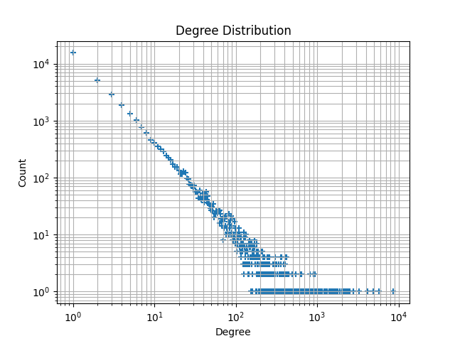
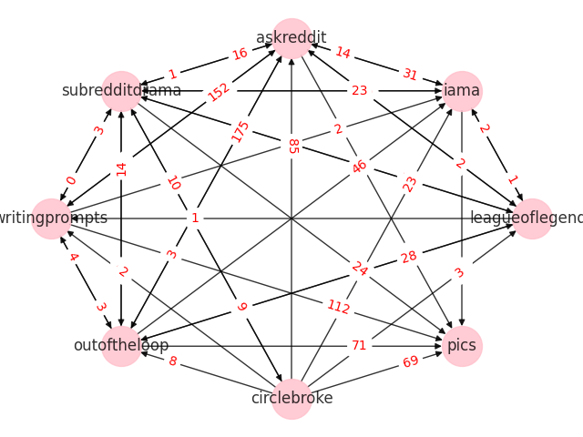
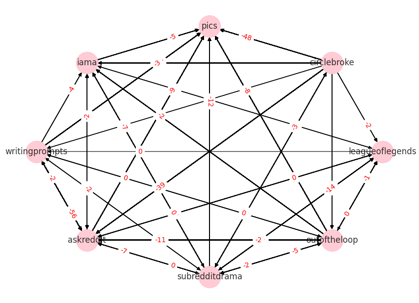

# ProjetNetwork
*Flora Gaudillère*  
*Yohann Faure*


This project aims at studying an interaction graph in the social network [reddit](https://www.reddit.com/)[^joke]. The data used can be found [here](http://snap.stanford.edu/data/soc-RedditHyperlinks.html).[^citation]


[^joke]: Let's be honnest, this whole Master is just an excuse to spend hours on social networks every day.

[^citation]: S. Kumar, W.L. Hamilton, J. Leskovec, D. Jurafsky. Community Interaction and Conflict on the Web. World Wide Web Conference, 2018.


Our **main goal** is to get familiar with the data structure**s** offered by `Networkx`, and to implement simple algorithms over said structures.


[TOC]


---

## 1 - Understanding the data

### 1.1 - How reddit works

In a nutshell, Reddit allows users to create communities, dedicated to a specific topic, named *subreddits*, designed by `r/their name`. For example the subreddit `r/cats` talks about cats. In a given community, one can then post images, text, or links, and redditors (the users of reddit) can then either upvote (like) ou downvote (dislike) the post.

### 1.2 - What is in the data

The network represents the directed connections between two subreddits, a connection being a post containing a direct hyperlink to an other subreddit. The network is extracted from publicly available Reddit data of 2.5 years from Jan 2014 to April 2017.

<a name="POST_LABEL"></a>

Each hyperlink is annotated with a value named `POST_LABEL`, which can either be $-1$ or $+1$, and that reflects the sentiment of the source post towards the target post. $-1$ means the source community is negatively judging the target, while $+1$ means the source is positively judging the target.

The way such label has been put onto every post is detailed in [this study](http://snap.stanford.edu/conflict/), but basically, it is done using Deep Learning.

The network is, by essence, directed, temporal, and attributed.

> **Note:** the date in the data is wrong. For example the datestamp of `POST_ID=34c15a`, from `r/changelog` to `r/redditdev`, is `2015-04-27`, while the real datestamp of this post is `2015-04-30`.


## 2 - File conversion : `ReadTSV.py`

First, we have to work on the data conversion, *i.e.* converting the original data, stored in a `.tsv` file into some NetworkX understandable format.

To do so, we created a python module composed of a few key functions, made specifically for this `.tsv` file format, and specialized for our data.

### 2.1 - Introducing MultiGraphs

The first attempt at reading the data led to edges being multiple times written, because most communities refers to themselves mutiple times. For example `r/trendingsubreddits` reffered to `r/changelog` 548 times, while the other way around, there is no post refering `r/trendingsubreddits` in `r/changelog`.

What is happening here is that there is a [post](https://www.reddit.com/r/changelog/comments/22pz96/reddit_change_trending_subreddits_on_the_front/) in `r/changelog`, created 2 days before the begining of the data collection, that mentioned a new functionality added to Reddit : a new subreddit (`r/trendingsubreddits`) in which is automatically posted every day the list of the best-performing subreddits of the day. Then, each post of this subreddit contained a link to this `r/changelog` post.

> What's this? We've started displaying a small selection of [trending subreddits on the front page](https://www.reddit.com/r/changelog/comments/22pz96/reddit_change_trending_subreddits_on_the_front/). Trending subreddits are determined based on a variety of activity indicators (which are also limited to safe for work communities for now). Subreddits can choose to opt-out from consideration in their subreddit settings.  
><div style="text-align: right"><cite>Every post in r/trendingsubreddits</cite></div>

### 2.2 - Selectionning information

In order to have a cleaner understanding of the data, and to represent this understanding, we decided to pre-select the data before introducing it into the networkx graph. We decided to create separate keys for the `POST_ID` (which is unique accros all posts, and therefore useful tu distinguish them), `TIMESTAMP` (in case we want to study a time-dependant property), and `POST_LABEL` (the positive or negative [review of the post](#POST_LABEL)).

All the rest f the data is stored raw from the `.tsv` file in `POST_PROPERTIES`, just in case we need it, but we did not use it in this project.

### 3.3 - Converting the file

```
>>> import networkx as nx
>>> import ReadTSV
>>> G=ReadTSV.data_to_digraph('body.tsv')
>>> G
<networkx.classes.multidigraph.MultiDiGraph object at 0x7f4d6c653850>
```

## 3 - Getting in touch with the data structure

### 3.1 - Storing the analysis functions : `Network_Analysis.py`

We  decided to group all of our functions in a single python file called `Network_Analysis.py`. This way, a simple `import Network_Analysis as NA`
allows us to use them seamlessly in the scripts.

To get details on the content of this module, feel free to use the following commands:
```
>>> import Network_Analysis as NA
>>> help(NA)
```

### 3.2 - First informations

In order to really understand the data structure of the graph, we fist wanted to plot it. But we had to check a few things before doing so.

```
>>> len(G.nodes)
35776
>>> len(G.edges)
286561
```

Plotting it might therefore not be an excellent idea. The graph is indeed too large to get a proper display using Networkx standard `draw` method. We could imagine a drawing method based on a cut of the graph, for example we could select the higest degree nodes and only plot them.

### 2.3 - Degree cutting

To cut according to the degree of the nodes, we need to find out what the distribution of the degrees is. To do so, we designed two functions called `degree_distribution`, and `Degree_distribution_plot`, that do just what their name indicate.

```
NA.Degree_distribution_plot(G)
```


This plot is quitte interesting, as it tells us that the distribution of degrees is broad, and might be called "scale-free". Here though, this is not a caracteristic of interest, therefore we will avoid all controversy and not call it "scale-free", just "with a broad degree distribution".

### 3.4 - Ploting

Now that we know that the distribution is broad, we can simply cut it on the degree, as such a cut would still preserve the overall structure of the graph, at least for visual inspection.

That is what `NA.degree_cut` does. It cuts the graph to only keep the highest degree nodes. One can specify the "degrees" on which to cut, making it more of a generic cut function. For example `degree_cut(G,2000,degrees=dic)` would return a graph composed of only the nodes of `G` with a score given by the dictionnary `dic` higher than 2000.

Let's plot it, using `NA.GraphDraw`. This function has a second argument that allows the selection of the interaction to plot (positive, negative, or total).

```
>>> GG=NA.degree_cut(G,2500)
>>> NA.GraphDraw(GG,1)
>>> NA.GraphDraw(GG,-1)
```




